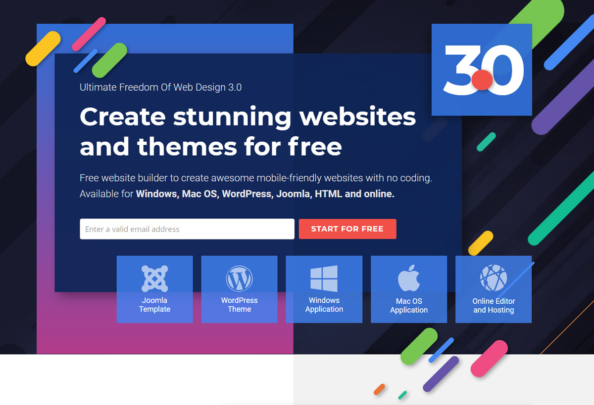
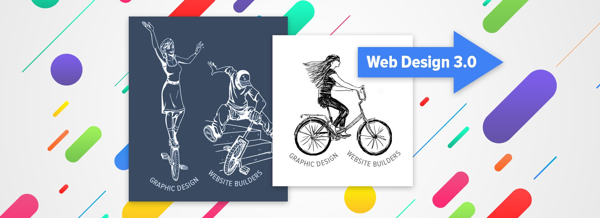
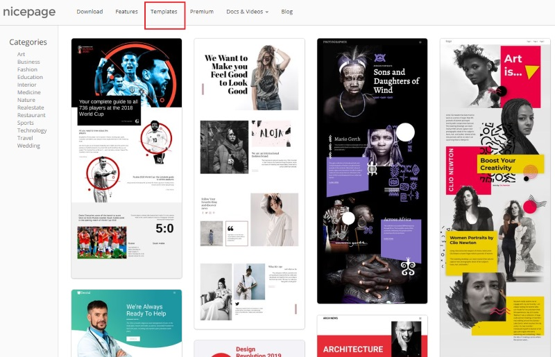
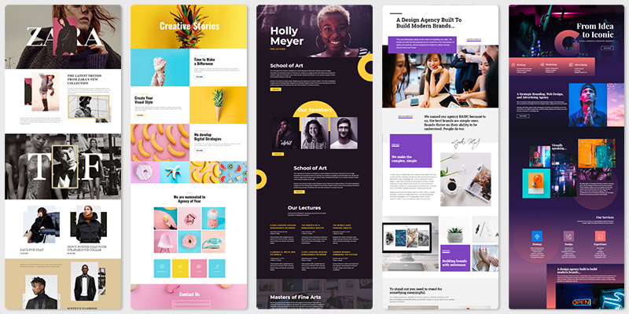
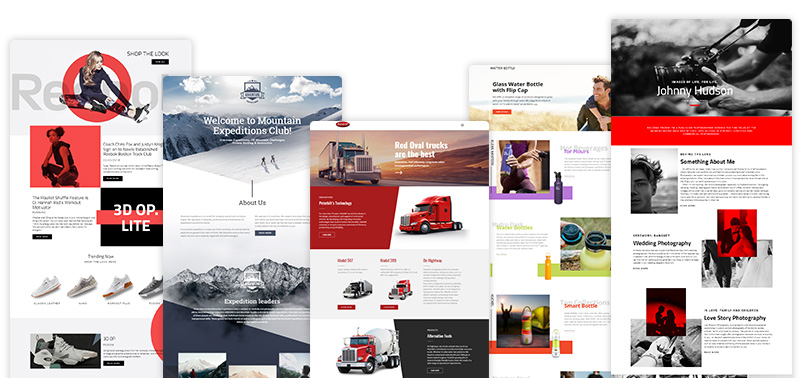

# Nicepage Website Builder

## Create stunning websites and themes
Nicepage gives the ultimate freedom for <a href="https://nicepage.com/blog/detail/22994/web-design-3-0-when-your-web-design-really-matters">Web Design 3.0</a>.
Build your mobile-friendly Joomla Templates, WordPress Themes and HTML5 websites with no coding in free desktop aplications for Windows and Mac. Nicepage Page Builder is available as a Joomla Extension and WordPress Plugin. There is also a Nicepage edition with online hosting.

## Absolute Creativity With No Coding
Nicepage is simple drag-and-drop editor to implement any ideas.
* **Easy Drag-n-Drop**. Easily drag-n-drop to customize anything on your website.
* **No Coding**. Add, edit, move, and modify everything. All visually!
* **Mobile-Friendly**. Build websites that look great on all modern devices.
* **1000s Web Templates**. Select from a huge variety of designer-made templates.

See <a href="https://nicepage.com/doc/article/11912/key-features">all Nicepage features</a>.

## Start With Beautiful Templates
Choose from <a href="https://nicepage.com/templates">1000+ awesome, mobile-friendly templates</a> for every kind of websites.
  

## Nicepage Update: February 2019
We have updated our Home page with the newest trends in Web Design 3.0. This design is also available in <a href="https://nicepage.com/blog/detail/22994/web-design-3-0-when-your-web-design-really-matters">Nicepage Templates</a>.

What's new in this update:
* New Home Page Design
* White Label Feature
* Firefox browser Beta support for Nicepage Builder
* Bug Fixes and New Features

<a href="https://nicepage.com/questions/25017/nicepage-update-february-2019">Read more</a>

## Web Design 3.0: When Your Web Design Really Matters

This article consists of several chapters:
1. The new revolution in Web Design has already happened. 
2. What makes Nicepage that different? 
3. We open the secret of the most trendy web designs on the Web.

<a href="https://nicepage.com/blog/detail/22994/web-design-3-0-when-your-web-design-really-matters">Read more</a>

## Nicepage Update: December 2018

What's new in this update:
* New Videos: How to use Grid and How to use Sections
* New Web Design Gallery
* Growth in Nicepage Pins views
* Upcoming Features, Improvements and Fixes

<a href="https://nicepage.com/questions/19980/nicepage-update-december-2018">Read more</a>

## Nicepage Update: November 2018

What's new in this update:
* New Free Version
* New Video: Menu Demo
* New Language Translations for the Nicepage User Interface
* Bug Fixes and New Features

<a href="https://nicepage.com/questions/16687/nicepage-update-nov-2018">Read more</a>

## Nicepage Update: October 2018

What's new in this update:
* New Video: Menu Demo
* New Language Translations for the Nicepage User Interface
* New Container Options
* New Site Designs
* Bug Fixes and New Features

<a href="https://nicepage.com/questions/10239/nicepage-update-oct-2018">Read more</a>

## Nicepage Update: September 2018

What's new in this update:
* Client Licenses
* Voting Results
* New Demo Videos: How to use Joomla Positions and WordPress Sidebars
* Bug Fixing and New Features
* New Designs
* Upcoming Features

<a href="https://nicepage.com/questions/7044/nicepage-update-sep-oct-2018">Read more</a>
